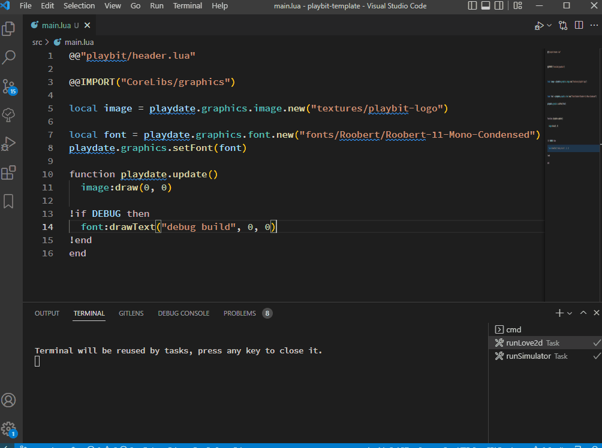

# Playbit

Playbit is a framework for creating cross-platform [Playdate](https://play.date/) games from a single [Lua](https://www.lua.org/) codebase. To accomplish this, it has two key components:
* A reimplemention of the [Playdate API](https://sdk.play.date/Inside%20Playdate.html) in [Love2D](https://love2d.org/).
* A build system that utilizes [LuaPreprocess](https://github.com/ReFreezed/LuaPreprocess/) to strip/inject platform dependent code.

**⚠ IMPORTANT:** This project is in active development and has not reached a stable 1.0 release yet. Use in a production environment at your own risk. 

## Key Features
* Partial reimplementation of Playdate API in Love2D
* Custom build scripts
* Custom preprocessor flags
* Export [Aseprite (.aseprite)](https://www.aseprite.org/) files at build-time
* Convert [Caps](https://play.date/caps/) fonts to [BMFonts](https://www.angelcode.com/products/bmfont/) at build-time
* Custom build-time file processors
* Macro support (via LuaPreprocess's [macros](http://luapreprocess.refreezed.com/docs/extra-functionality/#insert-func))
* Compile asserts out for release builds (via LuaPreprocess's [ASSERT() macro](http://luapreprocess.refreezed.com/docs/api/#assert))

## Known issues
Listed below are key issues; for a full list see [the issue tracker](). 

* Playdate API is not fully reimplemented
* Build script does not support Mac (Have a Mac? [Help get this fixed](https://github.com/GamesRightMeow/playbit/issues/1)!)
* Build-time creation of [.love-file and platform executables](https://love2d.org/wiki/Game_Distribution)
* Fonts
  * Only ASCII characters are supported
  * The glyph atlas must have 16 glyphs per row

Most of these exist only because they haven't been addressed/implemented yet. If you'd like to help improve/solve/fix an issue, please see the [Contributing guide](contributing.md).

There are, however, some fundamental limitations due to the nature of this framework. To learn more, see [Playbit limitations](limitations.md).

## Documentation
Documentation can be found in the [docs](/docs/) folder. If you're new, it's recommended that you first read [Getting Started](getting-started.md).